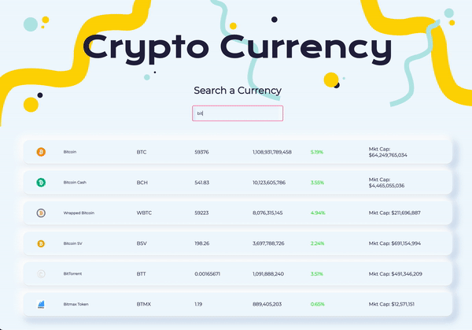
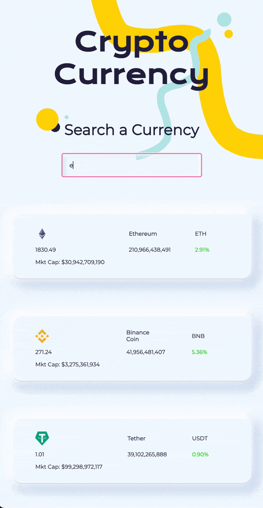

  <!--  -->
  

 <h2 align='center' border-bottom='none'>Crypto Currency </h2>
 <h2 align='center' border-bottom='none'>https://vibrant-feynman-c1f592.netlify.app<h4 align='center'>Stay up to date with your digital currencies<h4></h2>

## Motivation

Crypto currencies are making a huge come back, so I wanted to create a mini project that displays the current price of crypto currencies while focusing and creating a responsive layout.

## The product

##### Screen Size: Web

##### Screen Size: Mobile

<!--  -->

<!-- ##### Live Post

 -->

## Tech/framework used

<b>Built with</b>

- [React](https://reactjs.org/)
- [Material UI](https://material-ui.com/)
- JavaScript
- HTML
- CSS

## Features

**Live Code Editor & Chat**\
A Live post contains a chat client and a code editor. The code editor is available to and editable by all users who are viewing that post. No matter who is typing, all users are able to view any changes made.

**++ Button**\
If you come across a post to which you would also like to know the answer, or a post you find interesting, use the ++ button to show your support! You can view the most popular posts on your feed, and also see all posts you have ++'ed in your personal account.

**Content Tagging**\
When you create a post, you have the ability to label it with tags. You can also see all posts that have the same tags. On your homepage, you can quickly access a list of the most popular tags.

**Followers & Following**\
If you find a user who posts interesting content, you can follow them! Posts on the homepage will have a follow button. You also can view a user's profile, see all posts they have created, and follow them from there.

## Installation

If you want to check out the app for yourself, please visit https://two-plus.web.app.

If you want to install the app locally, feel free to fork this repo. Once downloaded, run `npm install`. You will need to create Firebase project and copy all config variables into a .env.local file that will accessed by `src/firebase.js`.

## How to use?

## Credits

We want to thank  and the  for giving us the opportunity to learn the art of code and grow during such a tumultous time. Special thanks to  and  for helping us make Two Plus a reality.

  
  &nbsp;&nbsp;&nbsp;&nbsp;&nbsp;&nbsp;&nbsp;&nbsp;&nbsp;
  

